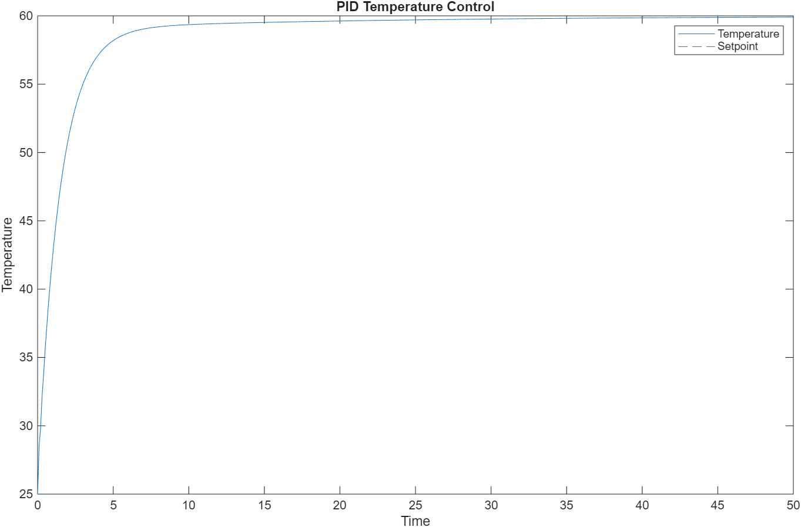
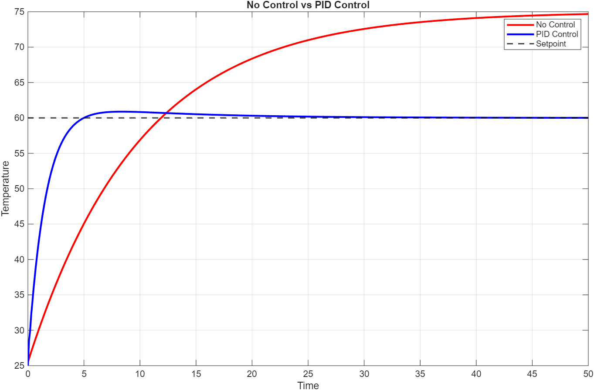
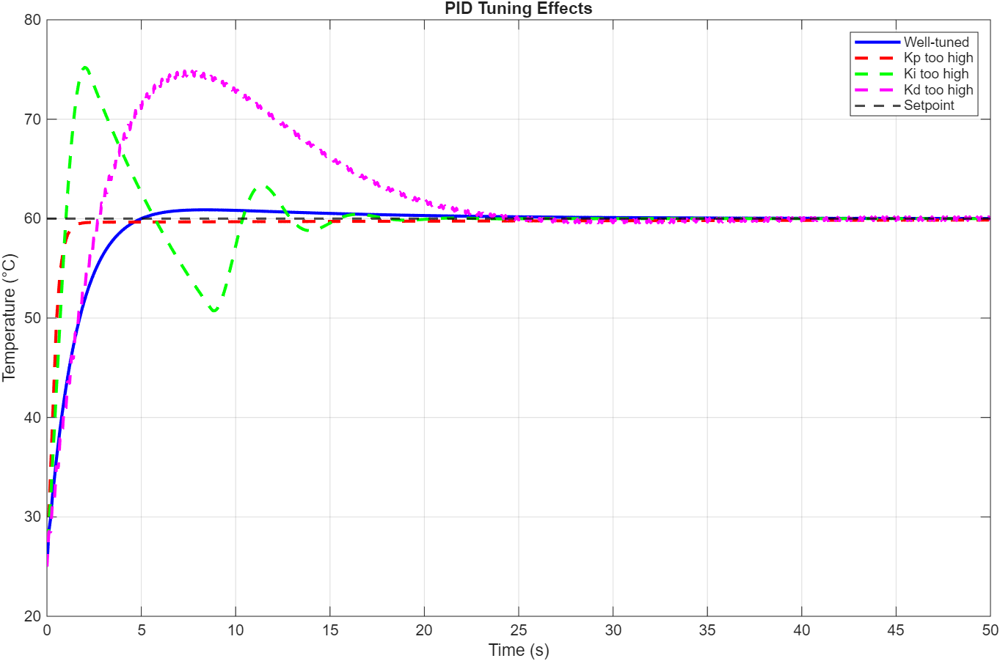

# PID Temperature Control for Simulation

## Project Overview
This project demonstrates the design and simulation of a PID controlller to regulate tempearture in a dynamic thermal system.
The system models a heater that raises temperature over time while losing heat to  the environment. A PID controller is implemented to ensure the temperature reaches and maintains a desired setpoint efficiently.

---

## Objectives
- Model a first-order thermal system
- Implement PID control
- Compare uncontrolled vs controlled behaviour
- Analyze the effect of PID parameeter tuning
  
## System Model: 
**First-order thermal system:**

`{dT}/{dt} = -a(T - T_env) + b . u`

Where:
  - T = system temperature
  - T_env = ambient temperature
  - u = control input (heater)
  - a, b = system constants

## PID Control:
**Adjusts `u` to maintain a target temperature (`setpoint`) using:** 

`u = K_p *e + K_i{int(e) dt} + K_d({de}/{dt})`

Where e = T_setpoint - T

---

## Scripts Included

| Script | Description |
|--------|-------------|
| `Good_tuning.m` | Demonstrates well-tuned PID response. |
| `GoodTuningvsBadTuning.m` | Compares well-tuned vs poorly-tuned PID controllers. |
| `PIDvsNoControl.m` | Compares system response without control vs PID control. |

---

## How to Run

1. Open MATLAB.  
2. Navigate to this repository folder.  
3. Run any of the scripts (`.m` files) to simulate and visualize PID behavior.  

---

## Results and Insights
### Plots
1. Well tuned PID response

2. No Control vs PID

3. Good tuning vs Bad tuning

### Tuning Observations
- **High `Kp`** → Fast response but may overshoot.  
- **High `Ki`** → Eliminates steady-state error but may cause oscillations.  
- **Low `Kd`** → Underdamped, oscillatory response.  
- **High `Kd`** → Overshoot followed by slow decay; can overreact to rapid changes.  

---

## Key Learnings
- PID controllers reply heavily on proper tuning
- Each gain parameter affects system behavior differently
- Simulation is essential before real-worldd implementation

## Optional Enhancements

- Add more visualizations for control signal `u` over time.  
- Introduce noise to simulate a real-world thermal system.  
- Create functions to reuse PID logic across different scripts.
- Use optimization methods for automatic tuning

---

## Author

Sara Mbachu – Industrial Automation and Control Systems Engineer
